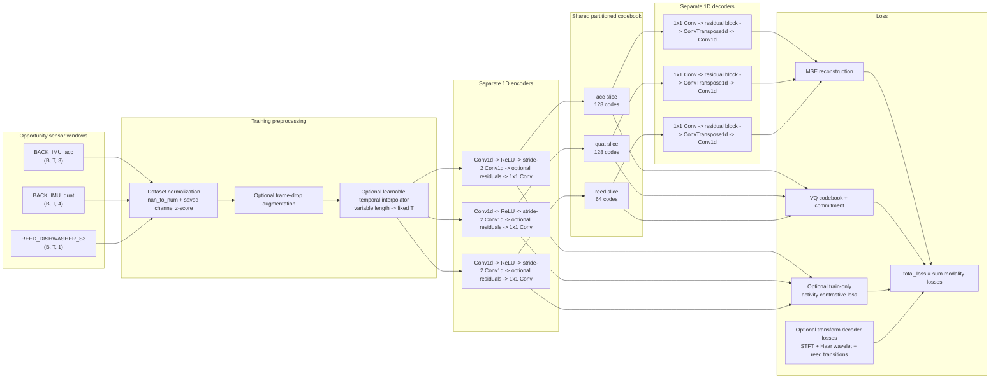

# Shared Multimodal VQ-VAE Architecture

Current implementation: `Code/vqvae/models.py`



## What The Current Model Does

- Each modality has its own encoder and decoder.
- The quantizer is shared as one tensor, but each modality only uses its own fixed slice.
- The encoder downsamples time by 2 using a strided convolution.
- The decoder upsamples time using `ConvTranspose1d`.
- Decoder residual blocks are enabled by default (`--decoder_res_blocks 1`).
- Encoder residual blocks are off by default (`--encoder_res_blocks 0`) to keep
  sensor-to-code inference fast. Enable them only if quality needs it.
- Training computes mean/std once over the selected training windows, saves them
  as `norm_stats.json` in the checkpoint directory, and reuses them for later
  training/evaluation/inference runs.
- Optional temporal augmentation can randomly drop frames. A learnable temporal
  interpolator first linearly resamples the remaining frames to the configured
  input length, then applies a small learnable convolutional refinement.
- Optional label-aware training uses a training-only CLIP-style loss between
  pooled sensor latents and activity label embeddings. Labels do not enter the
  encoder, quantizer, decoder, or reconstruction path.
- Optional transform decoder heads predict transform-domain features directly
  from the quantized latent. Their predictions are compared against transforms
  computed from the target raw signal: STFT magnitude for frequency content,
  Haar wavelet coefficients for multiscale shape, and first differences for
  sparse reed/contact transitions.

## Suggested Changes

1. Remove or replace mostly constant streams.

   `REED_DISHWASHER_S1` was effectively inactive in sampled windows.
   `REED_DISHWASHER_S3` is a slightly more active replacement, but reed/contact
   streams are still sparse. Train IMU-only first if codebook collapse returns.

2. Add residual encoder/decoder blocks.

   The current encoder/decoder is very shallow. A VQ-VAE usually benefits from small residual blocks around the latent projection:

   ```text
   Conv -> ReLU -> Conv -> residual add
   ```

3. Track reconstruction loss and VQ loss separately in tqdm.

   Right now the progress bar shows only total loss. Showing `recon_loss`, `vq_loss`, and perplexity makes collapse obvious earlier.

4. Consider EMA codebook updates.

   `models.py` already contains EMA quantizer classes, but `MultiModalSharedVQVAE` uses the non-EMA quantizer. EMA updates are often more stable for VQ-VAE training.

5. Add validation reconstruction plots.

   Save a small plot every epoch comparing input vs reconstruction for each modality. This is more useful than only watching loss.

6. Tune label conditioning carefully.

   Label-aware training can help make codes activity-aware without requiring
   labels at inference, but a large contrastive weight can overpower
   reconstruction. Start around `0.01` to `0.05` and watch reconstruction loss
   and perplexity together.

## Good Next Experiment

Train only the active IMU streams first:

```text
BACK_IMU_acc:3,BACK_IMU_quat:4,RUA_IMU_acc:3,RUA_IMU_quat:4
```

Then add sparse reed/contact sensors after the reconstruction pipeline is stable.
