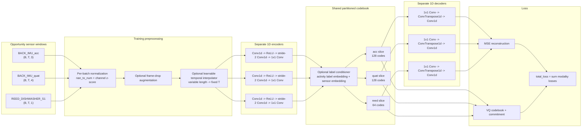

# Shared Multimodal VQ-VAE Architecture

Current implementation: `Code/vqvae/models.py`



## What The Current Model Does

- Each modality has its own encoder and decoder.
- The quantizer is shared as one tensor, but each modality only uses its own fixed slice.
- The encoder downsamples time by 2 using a strided convolution.
- The decoder upsamples time using `ConvTranspose1d`.
- Training currently normalizes each batch per modality/channel before feeding the model.
- Optional temporal augmentation can randomly drop frames. A learnable temporal
  interpolator first linearly resamples the remaining frames to the configured
  input length, then applies a small learnable convolutional refinement.
- Optional label-aware quantization embeds an activity label and a sensor id,
  adds that context to the encoder latent before codebook lookup, and can add a
  small CLIP-style contrastive loss between pooled sensor latents and activity
  label embeddings.

## Suggested Changes

1. Add dataset-level normalization stats.

   Per-batch normalization fixes NaNs, but it makes checkpoint behavior depend on the batch. Better: compute mean/std per stream on the training set, save them with the checkpoint, and reuse them for validation/inference.

2. Remove or replace mostly constant streams.

   `REED_DISHWASHER_S1` was all zeros in sampled windows. That can train, but it does not teach the model much and can encourage codebook collapse. Use a more active binary stream or train IMU-only first.

3. Add residual encoder/decoder blocks.

   The current encoder/decoder is very shallow. A VQ-VAE usually benefits from small residual blocks around the latent projection:

   ```text
   Conv -> ReLU -> Conv -> residual add
   ```

4. Track reconstruction loss and VQ loss separately in tqdm.

   Right now the progress bar shows only total loss. Showing `recon_loss`, `vq_loss`, and perplexity makes collapse obvious earlier.

5. Consider EMA codebook updates.

   `models.py` already contains EMA quantizer classes, but `MultiModalSharedVQVAE` uses the non-EMA quantizer. EMA updates are often more stable for VQ-VAE training.

6. Add validation reconstruction plots.

   Save a small plot every epoch comparing input vs reconstruction for each modality. This is more useful than only watching loss.

7. Tune label conditioning carefully.

   Label conditioning can help make codes activity-aware, but a large contrastive
   weight can overpower reconstruction. Start around `0.01` to `0.05` and watch
   reconstruction loss and perplexity together.

## Good Next Experiment

Train only the active IMU streams first:

```text
BACK_IMU_acc:3,BACK_IMU_quat:4,RUA_IMU_acc:3,RUA_IMU_quat:4
```

Then add sparse reed/contact sensors after the reconstruction pipeline is stable.
