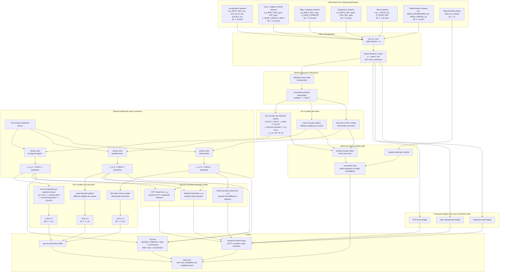

# Shared Multimodal VQ-VAE Architecture

Current implementation:

- Model: `Code/vqvae/models.py`
- Trainer: `scripts/train_shared_vqvae.py`
- Main mixed runner: `scripts/run_vqvae_cuda_10pct.ps1`
- Transform-head runner: `scripts/run_vqvae_cuda_10pct_transform.ps1`
- Activity auxiliary-loss runner: `scripts/run_vqvae_cuda_10pct_imu_label.ps1`
- Full-scale runner: `scripts/run_vqvae_cuda_full_scale.ps1`

## Big Picture

The core model is a multimodal VQ-VAE. Each sensor stream has its own encoder and
raw decoder, but all streams share one codebook tensor split into modality-specific
slices.

Small debug runners use a few streams such as `BACK_IMU_acc`,
`BACK_IMU_quat`, and `REED_DISHWASHER_S3`. The full-scale runner is different:
it selects 89 streams across acceleration, gyro/angular velocity, reed/contact,
mag/compass, shoe, and quaternion families.

The main inference path is:

```text
sensor window -> normalization -> encoder -> vector quantizer -> raw decoder
```

Training can add extra auxiliary losses, but labels and transform heads are not
required for basic inference.

## Full Wiring



## Main Inference Path

For sensor-to-code inference, the important path is:

```text
normalized sensor stream
  -> Encoder1D
  -> SharedVectorQuantizer or SharedEMAVectorQuantizer
  -> indices / z_q
```

For reconstruction inference, continue through:

```text
z_q -> Decoder1D -> reconstructed sensor stream
```

No activity labels are needed at inference.

## Per-Modality Flow

For each modality `m`:

```text
x_m: (B, T, C_m)
  -> nan_to_num
  -> dataset z-score using norm_stats.json
  -> optional frame drop during training
  -> optional temporal interpolator back to T
  -> Encoder1D
  -> z_e_m: (B, T/2, latent_dim)
  -> quantizer slice for modality m
  -> z_q_m, code indices, perplexity
  -> raw Decoder1D
  -> recon_m: (B, T, C_m)
```

Raw reconstruction loss:

```text
MSE(recon_m, normalized_target_m)
```

VQ loss:

```text
standard quantizer:
  codebook_loss + beta * commitment_loss

EMA quantizer:
  beta * commitment_loss
  codebook updated through EMA buffers
```

## Shared Partitioned Codebook

The codebook is one tensor, but each modality uses a fixed contiguous slice.

Example:

```text
BACK_IMU_acc       -> codes 0..127
BACK_IMU_quat      -> codes 128..255
REED_DISHWASHER_S3 -> codes 256..319
```

Perplexity is computed per modality slice. If perplexity is near `1.0`, that
modality is mostly using one code.

## Optional Transform Decoder Heads

These heads are training-only auxiliary decoders from `z_q`. They do not replace
the raw decoder.

For IMU-like streams:

```text
z_q -> STFT head -> predicted STFT magnitude features
raw target -> torch.stft -> target STFT magnitude features
loss = L1(predicted, target)
```

```text
z_q -> wavelet head -> predicted Haar features
raw target -> Haar transform -> target Haar features
loss = L1(predicted, target)
```

For reed/contact streams:

```text
z_q -> transition head -> predicted first-difference features
raw target -> x[t] - x[t-1] -> target transition features
loss = SmoothL1(predicted, target)
```

The intent is to force the quantized latent to preserve information useful for
frequency content, multiscale shape, and sparse contact transitions.

## Optional Activity Auxiliary Loss

Activity labels are only used during training.

```text
encoder latent z_e
  -> mean over time
  -> projection
  -> contrastive loss against activity label embedding
```

Labels do not enter:

- encoder input
- quantizer lookup
- raw decoder
- transform decoder heads
- inference path

This keeps inference label-free.

## Config Defaults

Important defaults in `scripts/train_shared_vqvae.py`:

```text
seq_len = 32
latent_dim = 32
hidden = 64
encoder_res_blocks = 1
decoder_res_blocks = 1
normalize_batch = false
dataset normalization = enabled
quantizer = ema
stft_loss_weight = 0.03
wavelet_loss_weight = 0.05
reed_transition_loss_weight = 0.20
activity_contrastive_loss = true
label_contrastive_weight = 0.02
learnable_loss_weights = true
```

Dataset normalization:

```text
checkpoint_dir/norm_stats.json
```

is computed once over the selected training windows and reused.

Training metrics:

```text
checkpoint_dir/metrics.csv
```

is appended once per epoch with averaged loss components and perplexity.

Disable defaults for ablations:

```powershell
--encoder_res_blocks 0
--decoder_res_blocks 0
--stft_loss_weight 0
--wavelet_loss_weight 0
--reed_transition_loss_weight 0
--no-activity_contrastive_loss
--no-learnable_loss_weights
--no-ema
```

## Reading Losses And Tuning Knobs

Do not judge training from `total_loss` alone. The model can have reconstruction,
VQ, activity, STFT, wavelet, and reed-transition losses active at the same time.

Use `metrics.csv` and the tqdm postfix:

```text
recon      raw reconstruction MSE
codebook   standard quantizer codebook loss; hidden for EMA
commit     commitment loss
label      optional activity contrastive loss
stft       optional STFT decoder-head loss
wavelet    optional Haar decoder-head loss
reed_d     optional reed transition decoder-head loss
ppl        codebook perplexity
```

Common patterns:

```text
recon flat or rising:
  lower lr
  reduce auxiliary loss weights
  try decoder_res_blocks 1 or 2
  verify norm_stats.json matches the run

ppl near 1.0:
  codebook collapse
  use --quantizer ema
  lower beta
  reduce auxiliary weights
  try IMU-only baseline
  consider k-means codebook initialization

commit very high:
  encoder outputs are far from codes
  lower beta if it dominates training
  lower lr if unstable

stft/wavelet high but recon okay:
  increase stft/wavelet weights gradually
  do not jump too high, or reconstruction may worsen

label high but recon worsens:
  lower LabelContrastiveWeight
  start around 0.01-0.05

reed_d always zero:
  selected windows may contain no reed transitions
  use a more active reed stream or larger data fraction
```

Useful first tuning order:

```text
1. Make recon go down on IMU-only EMA.
2. Check ppl stays above 1.
3. Add transform heads with small weights.
4. Add activity auxiliary loss with small weight.
5. Add sparse reed/contact streams.
6. Scale to full sensor families.
```

## Learnable Loss Weights

You can enable uncertainty-style learnable loss weighting:

```powershell
--learnable_loss_weights
```

This adds one learned scalar per loss family:

```text
w_recon
w_vq
w_label
w_stft
w_wavelet
w_reed_transition
```

Internally each enabled component is weighted like:

```text
exp(-log_var) * loss + log_var
```

Interpretation:

```text
larger w_*  -> model is emphasizing that loss more
smaller w_* -> model is down-weighting that loss
```

This helps when reconstruction, VQ, STFT, wavelet, reed transition, and activity
losses live on different numeric scales. It does not remove the need to inspect
the individual raw losses: a learnable weight can hide a bad objective by
down-weighting it.

## Common Runners

Mixed IMU + reed baseline:

```powershell
powershell -ExecutionPolicy Bypass -File scripts\run_vqvae_cuda_10pct.ps1 -Epochs 10 -Batch 32
```

IMU-only EMA baseline:

```powershell
powershell -ExecutionPolicy Bypass -File scripts\run_vqvae_cuda_10pct_imu_ema.ps1 -Epochs 10 -Batch 32
```

Activity auxiliary-loss run:

```powershell
powershell -ExecutionPolicy Bypass -File scripts\run_vqvae_cuda_10pct_imu_label.ps1 -Epochs 10 -Batch 32
```

Transform decoder-head run:

```powershell
powershell -ExecutionPolicy Bypass -File scripts\run_vqvae_cuda_10pct_transform.ps1 -Epochs 10 -Batch 32
```

Full-scale run over the requested sensor families:

```powershell
powershell -ExecutionPolicy Bypass -File scripts\run_vqvae_cuda_full_scale.ps1 -Epochs 10 -Batch 16
```

The full-scale launcher selects 89 groups from `group_map_official.json`:

```text
included:
  acceleration
  gyro / angular velocity
  reed / contact
  mag / compass
  shoe sensors
  quaternion

excluded:
  label_*
  MILLISEC
  LOCATION_TAG*
```

The full-scale launcher also assigns codebook size per stream from data
complexity. It scans raw `.dat` rows, estimates per-stream variance and temporal
change rate, then applies family-specific floors/caps. The allocation is saved:

```text
checkpoints/vqvae_full_scale/codebook_allocation.json
```

Disable adaptive allocation with:

```powershell
--no-adaptive_codebook
```

## Current Practical Notes

- `REED_DISHWASHER_S1` was effectively inactive in sampled windows.
- `REED_DISHWASHER_S3` is slightly more active, but reed/contact streams are
  still sparse.
- If codebook collapse returns, first compare against the IMU-only EMA runner.
- Encoder and decoder residual blocks are on by default now. Use
  `--encoder_res_blocks 0` when sensor-to-code inference speed matters most.
- The full-scale runner is heavier than the debug runners. Start with
  `-Batch 16` and `-DataFraction 0.10`, then scale up after checking memory and
  perplexity.

## Change Status

Done:

- Dataset-level normalization stats.
  - `norm_stats.json` is computed once per checkpoint directory.
  - Later runs reuse the saved stats.
  - Per-batch normalization is no longer the default.

- TQDM progress and loss visibility.
  - Progress bar shows total loss, reconstruction loss, codebook loss,
    commitment loss, perplexity, and enabled auxiliary losses.

- Separate codebook and commitment loss reporting.
  - `codebook_loss` and `commitment_loss` are returned separately.
  - `vq_loss` remains the combined VQ term.

- NaN protection and training stabilizers.
  - Input `nan_to_num`.
  - Lower default learning rate.
  - Gradient clipping.
  - Training stops before saving a checkpoint if loss becomes non-finite.

- Codebook initialization improvement.
  - Codebooks now use small uniform initialization instead of broad normal
    initialization.

- EMA quantizer option.
  - Use `--quantizer ema`.
  - IMU-only EMA runner exists:
    `scripts/run_vqvae_cuda_10pct_imu_ema.ps1`.

- More active reed stream in mixed runners.
  - Mixed runners now use `REED_DISHWASHER_S3` instead of
    `REED_DISHWASHER_S1`.

- Optional temporal robustness.
  - Random frame drop.
  - Learnable temporal interpolator back to fixed input length.
  - Runner:
    `scripts/run_vqvae_cuda_10pct_interp.ps1`.

- Training-only activity auxiliary loss.
  - Uses labels only for contrastive loss after the encoder.
  - Labels do not enter encoder, quantizer, decoder, transform heads, or
    inference.
  - Runner:
    `scripts/run_vqvae_cuda_10pct_imu_label.ps1`.

- Decoder residual blocks.
  - `--decoder_res_blocks 1` by default.
  - `--encoder_res_blocks 0` by default to keep code extraction fast.

- Optional transform decoder heads.
  - STFT feature decoder for IMU-like streams.
  - Haar wavelet feature decoder for IMU-like streams.
  - Transition feature decoder for reed/contact streams.
  - Runner:
    `scripts/run_vqvae_cuda_10pct_transform.ps1`.

Partially Done:

- Handling sparse reed/contact streams.
  - We switched to a slightly more active reed stream.
  - The reed streams are still sparse overall.
  - IMU-only training is still the cleanest baseline for debugging collapse.

- Activity-aware representation learning.
  - The auxiliary contrastive loss is implemented.
  - It still needs tuning: start with `LabelContrastiveWeight` around `0.01`
    to `0.05` and watch reconstruction/perplexity together.

Still Worth Doing:

- Validation loop.
  - Add a held-out validation subset.
  - Track train vs validation reconstruction loss and perplexity.

- Reconstruction plots.
  - Save input vs reconstruction plots per epoch for each modality.
  - This is the fastest way to see whether lower loss actually means useful
    reconstruction.

- Dataset split control.
  - Current `--data_fraction` samples a deterministic subset.
  - Add explicit train/val/test split files for repeatable experiments.

- K-means codebook initialization.
  - If perplexity collapses again, initialize each codebook slice from encoder
    outputs instead of random init.

- Inference/export helper.
  - Add a script that loads a checkpoint plus `norm_stats.json` and emits
    codes/latents for new sensor windows without labels.

- Better reed/contact objective.
  - Current transition head predicts first differences.
  - For truly binary contact streams, a BCE-style event head may be better than
    pure regression once labels/events are cleaned.
